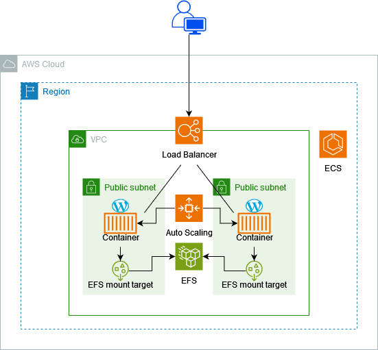

# WordPress Stack - CloudFormation

Projeto desenvolvido no módulo "Provisionamento como Código (AWS)" ministrado pelo professor Renato Marques ([@rmarqusi](https://github.com/rmarqusi)) na Formação DevOps através do programa Ser+Tech (Ada Tech + Núclea).

Repositório com o template para criação de uma stack WordPress através da AWS CloudFormation.

 O template faz a criação dos seguintes recursos:

- Um cluster ECS para hospedar os containers do WordPress.
- Uma definição de tarefa que especifica como os containers do WordPress serão configurados.
- Um serviço ECS para garantir que a tarefa do WordPress seja sempre executada.
- Um balanceador de carga para distribuir o tráfego entre os containers.
- Configurações de dimensionamento automático para ajustar automaticamente o número de containers com base na carga.
- Um sistema de arquivos EFS para armazenar dados persistentes do WordPress.

## Arquitetura

## Agradecimentos

Agradeço ao Rafael pelo apoio na provisionação do ambiente na AWS Cloudformation. Sua ajuda foi essencial para que eu pudesse concluir esse projeto.

[@Rafael](https://github.com/rafae1f)